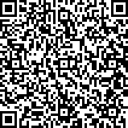

```{r, include = FALSE}
knitr::opts_chunk$set(
  collapse = TRUE,
  comment = "#>"
)
```

```{r setup, include=F}
library(rGeoCBI)
```

This vignette provides background and transparency for the digital data capture
of burn grading surveys.

## Creating the data capture form

* Design form in [ODK Build](https://build.opendatakit.org/)
* Include form (XML) in this package
* Deploy form to an ODK Central server, e.g. the 
  [DBCA ODK Central server](https://odkcentral.dbca.wa.gov.au/#/projects/2)

## Setting up a data capture device



* Install ODK Collect on an Android tablet and from Admin settings > Import 
  settings, scan the QR code shown here. This configures the tablet to the 
  DBCA server.
* "Get blank forms" and select the form "Burn Grading".
* Adjust settings to taste - auto-upload data in WiFi, reduce camera resolution.

## Capture data

* Follow the protocol on how to collect data.
* Consult the [ODK Collect user guide](https://docs.opendatakit.org/collect-intro/) 
  on how to use the app in general.
* Nitpick: take photos in landscape orientation (turn tablet sideways), as 
  this displays better on computer screens and in documents.
  
## Upload data

* Adjust ODK Collect settings to auto-upload data where WiFi is available.
* Bring the tablets into an area with WiFi.

