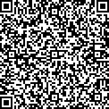

```{r, include = FALSE}
knitr::opts_chunk$set(
  collapse = TRUE,
  comment = "#>"
)
```

```{r setup, include=F}
library(rOzCBI)
```

This vignette provides background and transparency for the digital data capture
of burn grading surveys.

## Creating the data capture form

The forms are archived in this package in three formats:

* `.odkbuild` is the native [ODK Build](https://build.getodk.org/) format.
  You can import and export `.odkbuild` files in ODK build via 
  File > Load form from file and File > Save form to file, respectively.
  Exchange this file with other colleagues working on the form design.
  Currently, this format is the point of truth for form design.
  With the impending sunsetting of ODK Build, a move to XLSForm will be necessary.
* `.xml` is the [XForm](http://getodk.github.io/xforms-spec/) exported from 
  ODK Build, which you can import into the 
  [DBCA ODK Central server](https://odkc.dbca.wa.gov.au/#/projects/4).
* `.xslx` is the [XLSForm](https://xlsform.org/en/) exported from ODK Build,
  which can be modified further by hand, or even written from scratch by hand, 
  and become the point of truth for form design.
  

## Included forms

This package provides three forms:

* `OzCBI` as `system.file("odk/OzCBI.odkbuild", package = "rOzCBI")` for 
  forest burn grading.
* `HeathOzCBI` as `system.file("odk/HeathOzCBI.odkbuild", package = "rOzCBI")` for 
  heath burn grading.
* `FMSVerifySeverity` as `system.file("odk/FMSVerifySeverity", package = "rOzCBI")` for 
  forest burn grading verification and re-recording.

Each form is provided as `.odkbuild` ODK Build save file, `.xml` XForm, and as 
`.xlsx` XLSForm.

Previous form versions are included in the `inst/odk/archive` folder.
 
## Setting up a data capture device



* Install [ODK Collect from Google Play](https://play.google.com/store/apps/details?id=org.odk.collect.android) 
  onto an Android tablet, Add project, and 
  scan the QR code shown here. This configures the tablet to our DBCA server.
* Adjust settings to taste - auto-upload data only with WiFi, change image size 
  (medium, 2048px is a good balance between clarity and file size).

## Capture data

* Follow the data capture protocols.
* Consult the [ODK Collect user guide](https://docs.getodk.org/collect-intro/) 
  on how to use ODK Collect in general.
* Aim to take all photos in landscape orientation (turn device sideways), 
  as landscape photos display better on computer screens and in documents.
  
## Upload data

* Adjust ODK Collect settings to auto-upload data where WiFi is available.
* Bring the tablets into an area with WiFi.
